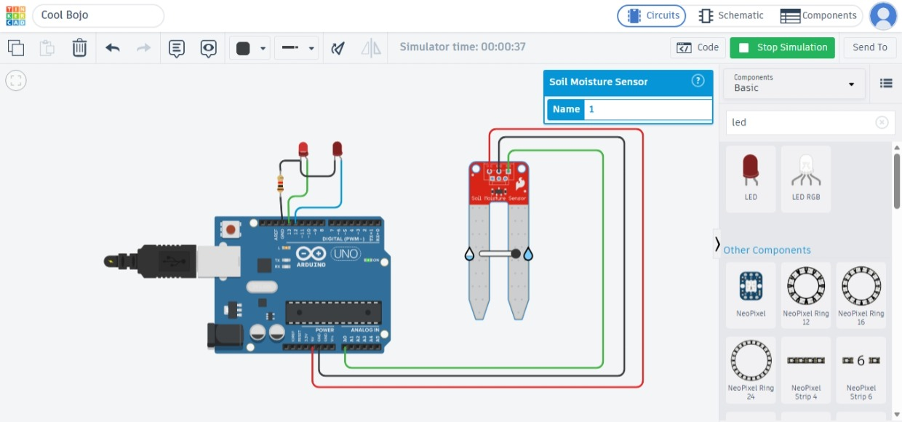

Activity 06 - Soil Moisture Sensor

## 1. Objective
To monitor soil moisture levels using a soil moisture sensor and provide visual status indicators via dual-colored LEDs using an Arduino UNO[span_0](start_span)[span_0](end_span).

## 2. Components Used
- Arduino UNO[span_1](start_span)[span_1](end_span)
- Soil Moisture Sensor with module[span_2](start_span)[span_2](end_span)
- Red LED[span_3](start_span)[span_3](end_span)
- Green LED[span_4](start_span)[span_4](end_span)
- 220 Ω Resistor[span_5](start_span)[span_5](end_span)
- Breadboard[span_6](start_span)[span_6](end_span)
- Jumper Wires[span_7](start_span)[span_7](end_span)

## 3. Circuit Diagram


## 4. Arduino Program (`code.ino`)
```cpp
const int sensorPin = A0;

const int redLED = 13;
const int greenLED = 12;

void setup() {
  pinMode(redLED, OUTPUT);
  pinMode(greenLED, OUTPUT);

  Serial.begin(9600);[span_8](start_span)[span_8](end_span)
}

void loop() {
  int moisture = analogRead(sensorPin);[span_9](start_span)[span_9](end_span)

  Serial.print("Moisture Value: ");
  Serial.println(moisture);

  if (moisture > 500) {
    // Dry soil
    digitalWrite(redLED, HIGH);
    digitalWrite(greenLED, LOW);
  }
  else {
    // Wet soil
    digitalWrite(redLED, LOW);
    digitalWrite(greenLED, HIGH);
  }

  delay(500);[span_10](start_span)[span_10](end_span)
}
6. Learning Outcome
Understood how to configure and utilize analog input pins with analogRead().  
Learned how to manage multiple digital outputs to control dual status indicator LEDs.
Mastered conditional threshold logic to drive hardware responses based on environmental data.
7. Challenges Faced
Error: Confusing sensor threshold boundaries causing erratic LED switching.
Solution: Monitored the Serial Monitor to analyze live baseline values and fine-tuned the threshold boundary to 500.
8. Real-World Applications
Automated agricultural irrigation systems  
Smart plant watering pots  
9. Connection to Your PoC
This dual-indicator soil moisture setup serves as the visual alert sub-system for my Smart Irrigation System Proof of Concept, displaying clear dry and wet conditions.
